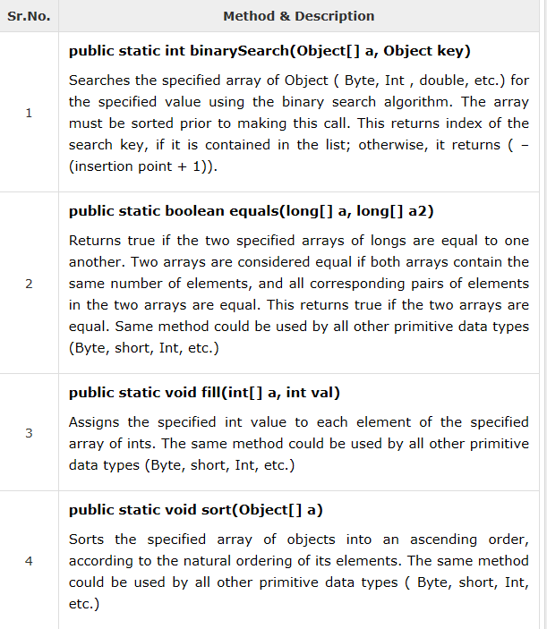

## Java - 数组
Java提供了一个数据结构-**数组**，存储相同类型元素的固定大小的顺序集合。数组用于存储数据集合，但将数组视为相同类型的变量集合通常更有用。不需要声明单个变量，如`number0，number1，...和number99`，而是声明一个数组变量（`numbers`），使用`numbers [0]`，`numbers [1]`和...，`numbers [99]`来表示个体变量。
下面介绍了如何声明数组变量，创建数组和使用索引变量处理数组。
### 声明数组变量

要在程序中使用数组，必须声明一个变量来引用该数组，并且必须指定该变量可以引用的数组类型。这是用于声明数组变量的语法：
```java
dataType[] arrayRefVar;   // preferred way.(首选)
or
dataType arrayRefVar[];  // works but not preferred way.
```
```java
double[] myList;   // preferred way.
or
double myList[];   // works but not preferred way.
```
### 创建数组

可以使用以下语法的新运算符来创建一个数组：
```java
arrayRefVar = new dataType[arraySize];
```
- 上述语句做了两件事：它使用新的`dataType [arraySize]`创建一个数组。
它将新创建的数组的引用赋值给变量`arrayRefVar`。声明一个数组变量，创建一个数组，并将该数组的引用赋值给该变量可以合并成一个语句，如下所示：`dataType[] arrayRefVar = new dataType[arraySize];`
- 或者可以按如下方式创建数组：
```java
dataType[] arrayRefVar = {value0, value1, ..., valuek};
```
- 示例：声明一个数组变量myList，它创建一个由10个双精度型元素组成的数组，并将其引用赋给myList
```java
double[] myList = new double[10];
```

### 处理数组
处理数组元素时，我们经常使用for循环或foreach循环，因为数组中的所有元素都是相同类型，并且数组的大小已知。
- 这是一个完整的例子，展示了如何创建，初始化和处理数组：

```java
public class TestArray {

   public static void main(String[] args) {
      double[] myList = {1.9, 2.9, 3.4, 3.5};

      // Print all the array elements
      for (int i = 0; i < myList.length; i++) {
         System.out.println(myList[i] + " ");
      }

      // Summing all elements
      double total = 0;
      for (int i = 0; i < myList.length; i++) {
         total += myList[i];
      }
      System.out.println("Total is " + total);

      // Finding the largest element
      double max = myList[0];
      for (int i = 1; i < myList.length; i++) {
         if (myList[i] > max) max = myList[i];
      }
      System.out.println("Max is " + max);
   }
}
```
### foreach循环
JDK 1.5引入了一个新的for循环，称为foreach循环或增强for循环，这使您可以在不使用索引变量的情况下顺序遍历整个数组。
- 示例：以下代码显示数组myList中的所有元素

```java
public class TestArray {

   public static void main(String[] args) {
      double[] myList = {1.9, 2.9, 3.4, 3.5};

      // Print all the array elements
      for (double element: myList) {
         System.out.println(element);
      }
   }
}
```
### 数组作为方法的形参
就像将原始类型值传递给方法一样，也可以将数组传递给方法。例如，以下方法在int数组中显示元素：

```java
public static void printArray(int[] array) {
   for (int i = 0; i < array.length; i++) {
      System.out.print(array[i] + " ");
   }
}
```
### 方法返回数组
一个方法也可以返回一个数组。例如，下面的方法返回一个数组，它是另一个数组的反转：
```java
public static int[] reverse(int[] list) {
   int[] result = new int[list.length];

   for (int i = 0, j = result.length - 1; i < list.length; i++, j--) {
      result[j] = list[i];
   }
   return result;
}
```
### Arrays类
java.util.Arrays类包含各种静态方法，用于排序和搜索数组，比较数组和填充数组元素。这些方法对于所有基元类型都是重载的。

- 
