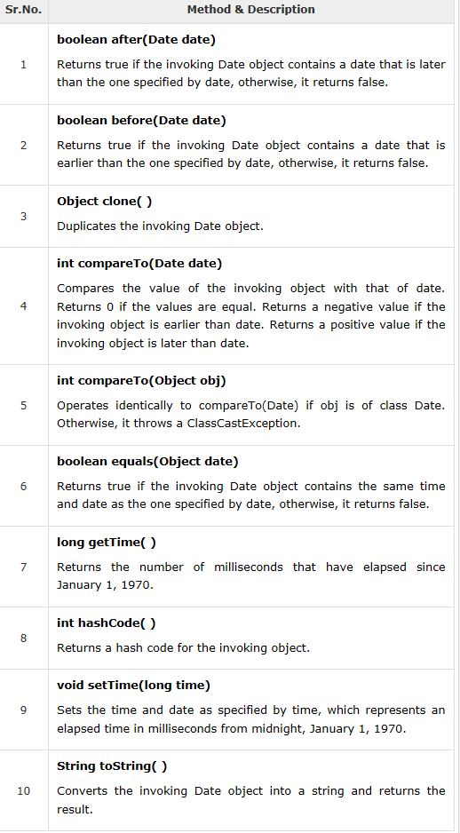
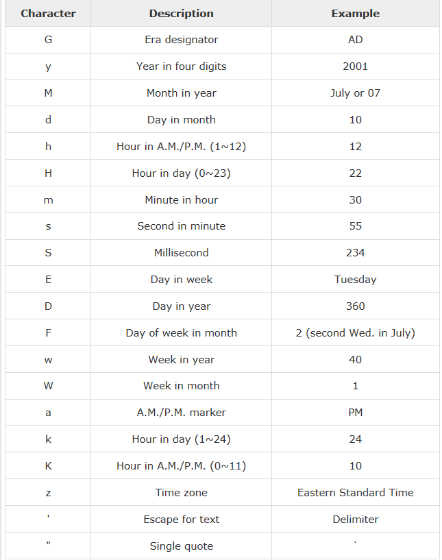
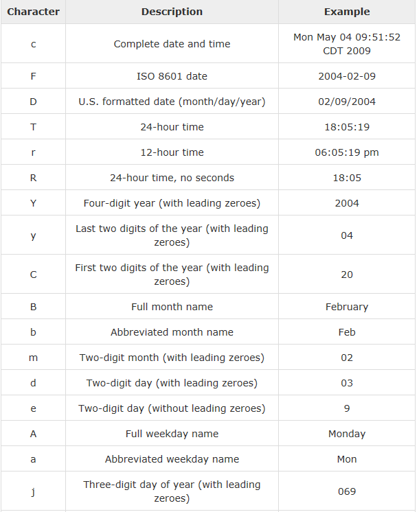
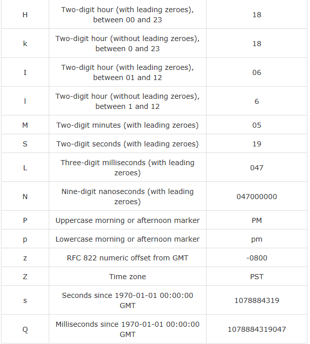

## Java - Date and Time
1、Java提供了java.util包中的Date类，该类封装了当前的日期和时间。
Date类支持两个构造函数，如下所示。
- Date()
这个构造函数用当前日期和时间初始化对象。

- Date(long millisec)
这个构造函数接受的参数等于自1970年1月1日午夜以来经过的毫秒数。

2、以下都是Date类的方法：

-  

3、Getting Current Date and Time
这是用Java获取当前日期和时间的一种非常简单的方法。可以使用带有`toString（）`方法的简单`Date`对象，按如下方式打印当前日期和时间：
```java
import java.util.Date;
public class DateDemo {

   public static void main(String args[]) {
      // Instantiate a Date object
      Date date = new Date();

      // display time and date using toString()
      System.out.println(date.toString());
   }
}
```

3、日期比较
- 以下是比较两个日期的三种方法 ：
- 可以使用`getTime（）`获取自1970年1月1日午夜以来经过的毫秒数，然后比较这两个值。
- 可以使用`before（）`，`after（）`和`equals（）`的方法。因为本月12日在18日之前，所以新日期（99，2，12）.before（新日期（99,2,18））返回true。
- 可以使用由`Comparable`接口定义并由`Date`实现的`compareTo（）`方法。

4、使用`SimpleDateFormat`日期格式化
- `SimpleDateFormat`是一个以区域敏感的方式格式化和解析日期的具体类。
- `SimpleDateFormat`允许您首先选择用于日期时间格式的任何用户定义的模式。
- 例如：

```java
import java.util.*;
import java.text.*;

public class DateDemo {

   public static void main(String args[]) {
      Date dNow = new Date( );
      SimpleDateFormat ft =
      new SimpleDateFormat ("E yyyy.MM.dd 'at' hh:mm:ss a zzz");

      System.out.println("Current Date: " + ft.format(dNow));
   }
}
```
```java
output:
Current Date: Sun 2004.07.18 at 04:14:09 PM PDT
```

5、简单的DateFormat格式代码

- 要指定时间格式，请使用时间模式字符串。在此模式中，所有ASCII字母都保留为模式字母，它们定义如下：

- 

6、使用`printf`打印日期格式

使用`printf`方法可以非常容易地完成日期和时间格式化。使用`two-letter`的格式，从`t`开始，并以表格的一个字母结尾，如下面的代码所示。

```java
import java.util.Date;
public class DateDemo {

   public static void main(String args[]) {
      // Instantiate a Date object
      Date date = new Date();

      // display time and date
      String str = String.format("Current Date/Time : %tc", date );

      System.out.printf(str);
   }
}
```
```java
output:
Current Date/Time : Sat Dec 15 16:37:57 MST 2012
```
- 如果不得不多次提供`Date`来格式化每个部分，那将会有点愚蠢。因此，格式字符串可以指示要格式化的参数的索引。
- **索引必须紧跟在％之后，并且必须以$结尾**

```java
import java.util.Date;
public class DateDemo {

   public static void main(String args[]) {
      // Instantiate a Date object
      Date date = new Date();

      // display time and date
      System.out.printf("%1$s %2$tB %2$td, %2$tY", "Due date:", date);
   }
}
```
```java
output:
Due date: February 09, 2004
```
- 或者，可以使用`<`标志。它表示应该再次使用与前面格式规范中相同的参数。

```java
import java.util.Date;
public class DateDemo {

   public static void main(String args[]) {
      // Instantiate a Date object
      Date date = new Date();

      // display formatted date
      System.out.printf("%s %tB %<te, %<tY", "Due date:", date);
   }
}
```
```java
output:
Due date: February 09, 2004
```
7、日期和时间转换字符

- 
- 

还有其他有用的类与日期和时间有关。有关更多详细信息，请参阅Java Standard文档。

8、 将字符串解析成日期
- `SimpleDateFormat`类有一些额外的方法，特别是`parse（）`，它试图根据存储在指定`SimpleDateFormat`对象中的格式来解析字符串。

```java
import java.util.*;
import java.text.*;

public class DateDemo {

   public static void main(String args[]) {
      SimpleDateFormat ft = new SimpleDateFormat ("yyyy-MM-dd");
      String input = args.length == 0 ? "1818-11-11" : args[0];

      System.out.print(input + " Parses as ");
      Date t;
      try {
         t = ft.parse(input);
         System.out.println(t);
      } catch (ParseException e) {
         System.out.println("Unparseable using " + ft);
      }
   }
}
```
```java
output:
1818-11-11 Parses as Wed Nov 11 00:00:00 EST 1818
```
9、 休眠
- 可以从一毫秒到计算机的整个使用寿命期间睡眠一段时间。例如，下面的程序会休眠3秒：
```java
import java.util.*;
public class SleepDemo {

   public static void main(String args[]) {
      try {
         System.out.println(new Date( ) + "\n");
         Thread.sleep(5*60*10);
         System.out.println(new Date( ) + "\n");
      } catch (Exception e) {
         System.out.println("Got an exception!");
      }
   }
}
```
```java
Output
Sun May 03 18:04:41 GMT 2009
Sun May 03 18:04:51 GMT 2009
```
