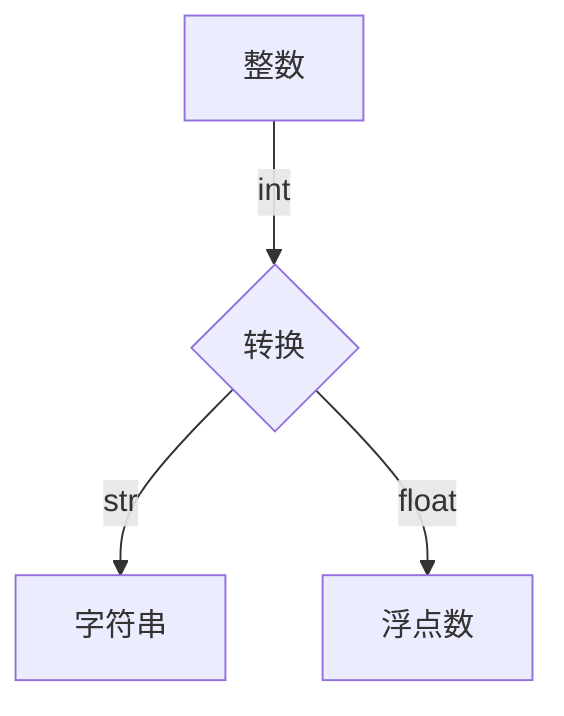

# 知识点记录
>python是一门脚本语言
## 前提
- 鱼C论坛上的课后练习要做（http://bbs.fishc.com/thread-36367-1-1.html）
- 跟上视频课程，做好记录。
## python的内置函数（BIF）
- 系统提供的内置函数，可以直接调用。
- 在IDLE中输入`dir(__builtins__)`可以看到python提供的内置方法列表，其中小写的就是BIF。
- 在shell中输入help(input)，就会得到这个BIF的功能描述。
## 变量和字符串
### 变量
- 在使用变量之前，必须对他赋值。
-  变量名可以包括字母、数字、下划线，不能用数字开头。（同C）
- 字母可以是大写，可以是小写，但大小写不同，比如fishc和FishC完全不同。
- 等号（=）是赋值的意思，左边是名字，右边是值。
- 变量名尽量取得专业些。
### 字符串
- 引号内的一切东西表示字符串，也叫作文本。
- 可以是单引号或双引号，必须成对。
- 如果想在字符串里面想出现单引号或者双引号，需要用**转义字符** **\\**
- 可以用反斜杠\对\自身进行转义。
- 但是对于一个字符串里出现多个\的字符串，可以在原始字符串前面加上一个英文字母r即可自动对字符串里的\进行转义。
`如：str = r'C:\now\fishc\a'`
- 在字符串的末尾加反斜杠怎么办？

  `可以在原始字符串前面加上一个英文字母r`
- 如果想得到一个跨越多行的字符串，需要用到一种**三重引号字符串**。


### 字符串的部分操作
- `s.isalnum()` ：所有字符都是数字或者字母，为真返回true,否则返回false。
- `s.isalpha()` ：所有字符都是字母，为真返回true,否则返回false。
- `s.isdigit()` ：所有字符都是数字，为真返回true,否则返回false。
- `s.islower()` ：所有字符都是小写，为真返回true,否则返回false。
- `s.isupper()` ：所有字符都是大写，为真返回true,否则返回false。
- `s.istitle()` ：所有字符都是首字母大写，为真返回true,否则返回false。
- `s.isspace()` ：所有字符都是空白字符，为真返回true,否则返回false。


## Python的数据类型
### 数值类型
- 整型：python3.0已经对整型和长整型进行了整合。
- 浮点型：带小数点的数据类型。
- e记法：科学计数法，用来表示特别大或特别小的数。如150000000000 => 1.5e11
- 布尔类型：true，false

### 类型转换

### 获得关于类型的信息
- 用`type()`函数获取数据类型，如`type(5.2)`  => `<class 'float'>`
- 用`isinstance()`函数，如`isinstance(5.int)`  => `true` **（推介使用）**
- python3可以给变量取中文名。

## Python的常用操作符
- 算术操作符：加（+）、减（-）、乘（*）、除（/）、幂运算（**）、整除（//）
- 优先级问题：
- 比较操作符：大于、小于、不等于。。。
- 逻辑操作符：与或非

## Python的分支与循环

### 分支
- if else
- if elif (**推介**)

### 三元操作符
   ```python
    x,y =4,5
    if x < y:
      small = x
    else:
      small = y
  ```
`改进为：`

  ```python
  small = x if x< y else y
  ```
### 断言
- 当这个关键字后边的条件为假的时候，程序自动崩溃并抛出异常。
- 使用它在程序中置入检查点，当需要确保程序中的某个条件一定为真的时候才能让程序正常工作。
- `assert 3 > 4`

### 循环
- while 循环
- for 循环 `for 目标 in 表达式`
- range():`range([start,] stop[,step = 1])`,与for循环搭配
- break、continue

## 列表：打了激素的数组
-  C的数组好比一个集装箱，存放相同数据类型的数据；由于python没有数据类型之分，所以python没有数组，但是有列表，列表就好比一个工厂。
- 列表包含整数、浮点数、字符串、对象。
### 1、创建一个普通的列表
- `member = ['wqq','wh','hamorq']`
- `number = [1,2,3,4,5]`
### 2、创建一个混合的列表
- 列表中包含列表
- `mix = [1,'wqq',3.14,[1,2,3]]`
### 3、创建一个空列表
- `empty = []`
### 4、向列表中添加元素
- `append()` 每次只能添加一个元素
- `member.append('wqqtosky')`
- `len(member)` 会加1
-
- `extend()` 可以将一个列表的元素添加进另一个列表
- `extend（[1,2,3]）`
-
- `insert(index,data)`将元素data插入另一个列表的制定位置
- `member.insert(1,'qq')` 把qq插入member列表的第2个位置，下标从0开始
### 5、从列表中获取元素
- 通过元素的索引值（index），从列表中获取单个元素。
- `member[2]`
### 6、从列表中删除元素（3种）
- `member.remove('wqq')`，不用知道wqq这个元素在什么位置，但是必须存在。
- `del mamber[1]`  ，清除第2个元素。
- `del mamber` ，删除整个列表。
- `mamber.pop()` ，删除列表的最后一个元素，并且会返回删除值，也可以赋值给其他。
### 7、列表分片
- 从列表中一次性获取多个元素，可以赋给一个新的列表，相当于列表的拷贝。
- `member[1:3]`，从`member`列表中取出下标1-2的元素，并以列表形式输出。
- `member[:]`，拷贝整个列表。
- `member[1:]`，从`member`列表中取出下标1-末尾的元素，并以列表形式输出。

## 列表的一些常用操作符
- 比较：当列表中有多个元素时，以第一个元素为准。
 - 

- 逻辑：
 - 
- 算术：`+`两边的数据类型必须相同，比如两个列表进行相加，代表列表的拼接。`*`表示对列表进行复制n次，`list3 `。
-`in`:判断某个元素是否在列表中，返回`true`或`false`，如`'wqq' not in mamber`,返回`false`。

## 列表的小伙伴
- `dir(list)`，返回列表的内置函数。
- `count`：计算参数在列表中出现的次数，`list.count('wqq')`，计算wqq出现的次数。
- `index`：返回参数在列表中出现的起始索引位置，也可以定义范围的起始和结束位置，`member.index('wqq',3,5)`,返回wqq在列表索引3-4范围出现的起始位置。
- **`reverse`**：将整个列表翻转。
- **`sort`**:将列表排序，默认升序。此方法含有3个参数(func(排序算法),key（关键字）,reverse)，前2个参数是默认参数，`list.sort(reverse=true)`,按升序排序。
> **复制整个列表时，最好用分片复制法，`list2 = list[:]`，这样能保证list改变后，list2不会跟随改变；若用这种复制法，`list2 = list`，list改变后，list2会跟随改变。**

## 元组：戴上了枷锁的列表

- 和列表非常相似，列表可以随意改变列表中的元素，元组不能。
- 创建一个元组：`tuple1 = (1,2,3,4,5)`，可以没有小括号，但不能没有逗号。
- 获取元组中的元素：`tuple1[2]`
- 元组的切片操作：同列表。
- 创建一个空元组：`temp =()`
- **元组的关键符号是逗号。**
- 元组的插入：
-
  
- 元组的删除：`del tuple` ，删除整个元组；

## 字符串的各种奇葩的内置方法
>字符串有很多的内置方法，具体可以看链接
http://bbs.fishc.com/thread-38992-1-1.html
## 字符串的格式化
- `format`方法：http://bbs.fishc.com/thread-92997-1-1.html

## 序列
### 列表、元组和字符串的共同点
- 都可以通过索引得到每一个元素。
- 默认索引值都是从0开始。
- 可以通过分片的方法得到一个范围内的元素的集合。
- 有很多共同的操作符（重复操作符、拼接操作符、成员关系操作符）

### 序列的内置函数
- `list()`:把一个可迭代对象转换成列表，如元组，字符串。
- `tuple()`:把一个可迭代对象转换成元组
- `str(obj)`:把一个obj对象转换成字符串。
- `len()`:返回序列或者参数的长度。
- `max()`:返回序列或者参数集合中的最大值，必须是同类型的数据。
- `min()`:返回序列或者参数集合中的最小值。
- `sum(iterable[,start=0])`:返回序列iterable和可选参数start的总和，必须是同类型的数据。
- `sorted()`:同列表的`sort`,`sorted(list1)`默认升序。
- `reversed()`:与列表的有所不同，`reversed(list1)`返回迭代器对象，需要间接返回list对象，。用`list(reversed(list1))`。
- `enumerate()`:枚举，生成由每个元素和其index组成的元组，`list(enumerate(list1))`。
- `zip()`:打包，返回由各个参数的序列组成的元组，`list(zip(list1,list2))`,把两个列表组合成一个列表，并把对应位置上的元素组合成元组。

## python的函数
- 定义：
  ```python
  def funcname(参数):
      函数体
  ```
- 函数的返回值：在函数体使用`return 值`。
- 函数文档：在函数体的开头写一个字符串介绍此函数的作用，即函数文档。
- 关键字：函数在传入实参的时候最好使用关键字指明是哪个参数。
- 收集参数：
  ```python
  def test(*params):#可以传入多个参数
    print("参数的长度：",len(params));
    print("第二个参数：",params[1]);
  ```
- 函数与过程：
- 内嵌函数：在一个函数内部再定义一个函数。
- 闭包：函数式编程，一种编程范式。
 - 

- **在内部函数中只能对外部函数的局部变量进行访问，不能进行修改。**
 - 
- 可以用容器类型来解决上面的问题，如列表。
 - 
- python 3可以用关键字`nonlocal`来解决上面的问题,`nonlocal`可以把变量强制声明为不是一个局部变量。

  - 

## python的lambda表达式
### 匿名函数

  ```python
  #这个是匿普通函数,输入ds(4)
  def ds(x):
    return 2 * x +1
  ```
  - 使用lambda表达式也可以输入多个参数，用逗号隔开。

  ```python
  #冒号左边代表示参数，右边表示表达式的返回值
  #这个是匿名函数，却可以同函数的调用方式，如输入g(4)
  g=lambda x : 2*x+1
  ```
  - 上面两处可以得到一样的结果

### lambda表达式的重要作用：
- 用python写执行脚本时，使用lambda可以省下定义函数过程，可以使代码变得更加简洁。
- 对于一些比较抽象并且整个程序执行下来只需要调用一两次的函数，有时候给函数起个名字也是比较头疼的问题，使用lambda就不需要考虑命名问题了。
- 简化代码的可读性，由于普通的函数经常要跳到开头def定义部分，使用lambda函数可以省去这样的步骤。

### 两个牛逼的BIF
- `filter`：过滤器。把任何不满足条件的内容给过滤掉。
```python
#输出1-10以内的偶数。
list(filter(lambda x : x%2,range(10)))
out:[1, 3, 5, 7, 9]
```
- `map`：映射。将序列的每一个元素作为函数的参数进行运算加工，返回所有元素加工后的新序列。
```python
#将1-10以内的数都乘以2。
list(map(lambda x : x*2,range(10)))
out:list(map(lambda x : x*2,range(10)))
```
## python的递归
- 函数调用自身。
- 消耗内存，慎重使用。
- 分治思想。
- 递归的正面示例（汉诺塔）

## python的字典（键-值对）
- 唯一的映射类型。
### 创建和访问字典
- 创建和访问字典
  ```python
  >>> dict1 = {'李宁':'一切皆有可能','耐克':'just do it',}
  >>> dict1['李宁']
  '一切皆有可能'
  ```
- 创建一个空字典
  ```python
  >>> dict1 = {}
  ```
- 用dict()创建一个字典
  ```python
  >>> dict3 = dict((('F',70),('C',67),('h',104)))#3重括号
  {'C': 67, 'h': 104, 'F': 70}

  >>> dict4 = dict(wqq = '让编程改变世界',wh= '真理至上')#键值不能用引号，否则会报错
  >>> dict4
  {'wqq': '让编程改变世界', 'wh': '真理至上'}

  ```
- 直接给字典的键赋值
  ```python
  >>> dict4['wqq']='加油'   #改变已经存在的值
  >>> dict4
  {'wh': '真理至上', 'wqq': '加油'}
  >>> dict4['qq']='haha'   #增加新的值
  >>> dict4
  {'wh': '真理至上', 'wqq': '加油', 'qq': 'haha'}
  ```
### 字典的内置方法
- 使用`fromkeys()`方法来创建字典
  ```python
  >>> dict1 = {}                      #创建一个空字典
  >>> dict1.fromkeys((1,2,3))         #只向字典中放入key
  {1: None, 2: None, 3: None}
  >>> dict1.fromkeys((1,2,3),'numbers')  #向字典中放入key,并放入一个值'numbers'
  {1: 'numbers', 2: 'numbers', 3: 'numbers'}
  >>> dict1.fromkeys((1,2,3),('one','two','three'))  #值'one','two','three'会分别对应每一个键
  {1: ('one', 'two', 'three'), 2: ('one', 'two', 'three'), 3: ('one', 'two', 'three')}
  >>> dict1.fromkeys((1,3),'numbers') #不能通过`fromkeys`属性来修改指定键对应的值，而是重新创建了一个字典
  {1: 'numbers', 3: 'numbers'}

  ```
- `keys()`:获取字典的键
  ```python
  >>> dict2={}
  >>> dict2.fromkeys((range(32)),'赞')
  {0: '赞', 1: '赞', 2: '赞', 3: '赞', 4: '赞', 5: '赞', 6: '赞', 7: '赞', 8: '赞', 9: '赞', 10: '赞', 11: '赞', 12: '赞', 13: '赞', 14: '赞', 15: '赞', 16: '赞', 17: '赞', 18: '赞', 19: '赞', 20: '赞', 21: '赞', 22: '赞', 23: '赞', 24: '赞', 25: '赞', 26: '赞', 27: '赞', 28: '赞', 29: '赞', 30: '赞', 31: '赞'}
  >>> for eachkey in dict2.keys():
  ...     print(eachkey)
  ...
  >>> dict2=dict2.fromkeys((range(32)),'赞')   #必须要赋值
  >>> for eachkey in dict2.keys():            #读取字典中的键
  ...     print(eachkey)
  ```
- `values()`:获取字典的值
  **用法同上面的keys()**
- `items()`:获取字典的各项
  ```python
  >>> for eachitem in dict2.items():
  ...     print(eachitem)
  ...
  (0, '赞')
  (1, '赞')
  (2, '赞')
  (3, '赞')
  (4, '赞')
  (5, '赞')
  (6, '赞')
  (7, '赞')
  (8, '赞')
  (9, '赞')
  (10, '赞')
  ...
  ```
- `get()`:访问字典的项
  ```python
  >>> dict2.get(32)       #访问一个不存在的键，就什么都不返回
  >>> dict2.get(3)        #访问一个存在的键，就返回它的值
  '赞'
  >>> dict2.get(32,'木有') #可以给一个不存在的键，指定一个值
  '木有'
  ```
- `in 、not in`:检查字典中的键值是否存在
  ```python
  >>> 31 in dict2
  True
  >>> 32 in dict2
  False
  ```
- `clear()`:清空一个字典
  ```python
  >>> a = {'姓名':'wqq'}
  >>> b=a
  >>> a
  {'姓名': 'wqq'}
  >>> b
  {'姓名': 'wqq'}
  >>> a={}              #这种方法也可清空列表，但是其他地方的缓存还在，如下 b
  >>> a
  {}
  >>> b
  {'姓名': 'wqq'}
  >>> a=b
  >>> a
  {'姓名': 'wqq'}
  >>> b
  {'姓名': 'wqq'}
  >>> a.clear()         #这种方法可彻底清空列表
  >>> a
  {}
  >>> b
  {}
  ```
- `copy()`:浅拷贝
  ```python
  >>> a = {1:'one',2:'two',3:'three'}
  >>> b=a.copy()                     #浅拷贝
  >>> c=a                            #直接赋值
  >>> a
  {1: 'one', 2: 'two', 3: 'three'}
  >>> b
  {1: 'one', 2: 'two', 3: 'three'}
  >>> c
  {1: 'one', 2: 'two', 3: 'three'}
  >>> id(a)                        #原本的地址
  139887466020232
  >>> id(b)
  139887466969736                 #浅拷贝后地址不同，只是对对象表层的拷贝
  >>> id(c)
  139887466020232                 #赋值之后与原地址相同

  >>> c[4]='four'                 #对c做改变后，a也会改变，但b不会变
  >>> a
  {1: 'one', 2: 'two', 3: 'three', 4: 'four'}
  >>> c
  {1: 'one', 2: 'two', 3: 'three', 4: 'four'}
  >>> b
  {1: 'one', 2: 'two', 3: 'three'}

  ```
- `pop()`与`popitem()`:前者是给定键弹出一个值，后者是弹出一个项
  ```python
  >>> a.pop(2)
  'two'
  >>> a
  {1: 'one', 3: 'three', 4: 'four'}
  >>> a.popitem()              #随机弹出一个项，因为字典中没有顺序，编排是按优先级。
  (1, 'one')
  >>> a
  {3: 'three', 4: 'four'}
  ```
- `setdefault()`:找不到对应的**项**时，自动添加
  ```python
  >>> a.setdefault('小白')
  >>> a
  {'小白': None, 3: 'three', 4: 'four'}
  >>> a.setdefault(5,'five')
  'five'
  >>> a
  {'小白': None, 3: 'three', 4: 'four', 5: 'five'}
  ```
- `update()`:对字典进行更新，找不到对应的**键**时，自动添加
  ```python
  >>> b={'小白':'狗'}
  >>> b
  {'小白': '狗'}
  >>> a.update(b)
  >>> a
  {'小白': '狗', 3: 'three', 4: 'four', 5: 'five', '小': '白'}
  >>> b={'小黑':'狗'}
  >>> a.update(b)
  >>> a
  {'小白': '狗', 3: 'three', 4: 'four', 5: 'five', '小黑': '狗', '小': '白'}
  ```
## python的集合

  ```python
  >>> num ={}
  >>> type(num)
  <class 'dict'>             #一对花括号，代表是字典，但不是字典的特权
  >>> num ={1,2,3,4,5}
  >>> type(num)             #一对花括号里有一堆数字，但这些数字没有映射关系，则代表是集合
  <class 'set'>
  ```
### 集合的特性：
- 集合存储的数据是唯一的，可以剔除掉重复的数据。
  ```python
  >>> num ={1,2,3,4,5,1,4,5,6}
  >>> num
  {1, 2, 3, 4, 5, 6}
  ```
- 集合是无序的，不能通过索引去访问某一个元素。
- 使用`set()`创建集合
  ```python
  >>> set1 = set([1,2,3,4,4])   #先把数据放进列表
  >>> set1
  {1, 2, 3, 4}
  ```
- 使用集合过滤重复元素
  ```python
  >>> num1 = [1,2,3,3,4,5,5,0]
  >>> num1
  [1, 2, 3, 3, 4, 5, 5,0]
  >>> num1 =list(set(num1))
  >>> num1
  [0,1, 2, 3, 4, 5]      #因为集合是无序的，所以可能会改变原始列表的顺序
  ```
- 访问集合中的元素
1、用`for`把集合中的数据一个个读取出来。
2、可以通过`in`和`not in`判断一个元素是否在集合中已经存在。

- 添加或删除
  ```python
  >>> num2={1,2,3,4}
  >>> num2.add(6)
  >>> num2
  {1, 2, 3, 4, 6}
  >>> num2.remove(2)
  >>> num2
  {1, 3, 4, 6}
  ```
- 不可变集合
  ```python
  >>> num3 = frozenset([1,2,3])  #把这个集合冻结了，不能改变
  >>> num3.add(6)
  Traceback (most recent call last):
    File "<stdin>", line 1, in <module>
  AttributeError: 'frozenset' object has no attribute 'add'
  ```
## python的文件
- 文件的格式有很多种，后缀识别。
### 打开文件
- 用`open`打开文件。
```
f = open('E:\\record.txt')

'r':以只读方式打开文件，默认
'w':写入的方式打开文件，会覆盖已经存在的文件
'x':如果文件已经存在，此模式打开将引发异常
'a':写入的方式打开文件，如果文件存在，会在文件末尾追加
'b':以二进制模式打开文件
't':以文本模式打开（默认）
'+':可读写模式（可添加到其他模式中使用）
'U':通用换行符支持
```
### 文件对象方法
```
f.close(): 关闭文件
f.read(size=-1)：从文件读取size个字符，当未给定size或给定负值的时候，读取剩余的所有字符，然后作为字符串返回。
f.readline()：从文件读取一行。
f.write(str)： 将字符串str写入文件。
f.writeline(seq)： 向文件写入字符串序列seq,seq应该是一个返回字符串的可迭代对象(list)。
f.seek(offset,from)： 在文件中移动文件指针。从from (0代表文件起始位置，1代表当前位置，2代表文件末尾)偏移offset个字节。
f.tell()： 返回当前在文件中的位置

list(f):可以把文件转换成列表。
```
### 将文件按行打印
  ```python
  f = open('E:\\record.txt')
  f.seek(0,0)
  for eachline in f:
      print (eachline)
  ```
## python的OS模块
- 有了os模块，我们**不需要关心什么操作系统下使用什么模块**，os模块会帮你选择正确的模块并调用。
- os模块和os.path模块的方法介绍：http://bbs.fishc.com/thread-45512-1-1.html
- 以上的方法需熟记。
## python的pickle(泡菜)模块

- `import pickle`
- 可以把python的所有对象转换成二进制的形式存放，也可以保存为'*.txt'的文件，只是打开后会是乱码。
- 主要用于将大量的数据存储起来，而不用放在源代码里。
- pickle的实质是利用一些算法将你的数据对象“腌制”成二进制文件，存储在磁盘上，当然也可以放在数据库或者通过网络传输到另一台计算机上。
- **pickle存储数据的方法**:`pickle.dump(data,file)`，参数一是待存储的数据对象，参数二是目标存储的文件对象。注意：要先用'wb'的模式open文件file。
- **pickle读取数据的方法**：'pickle.dump(file)',注意：要先用'rb'的模式open文件file。
- mylist =[1,2,3,'wqq']
  ```python
  #把列表的内容腌制（保存）起来
  >>> my_list =[1,2,3,'wqq']
  >>> pickle_file = open('my_list.pkl','wb') #必须以二进制写入方式打开
  >>> pickle.dump(my_list,pickle_file)       #把列表的内容放入文件中
  >>> pickle_file.close()
  >>> pickle_file = open('my_list.pkl','rb') #必须以二进制读取方式打开
  >>> my_list2 =pickle.load(pickle_file)     #从文件中把内容取出放进列表
  >>> print(my_list2)
  [1, 2, 3, 'wqq']
  ```
## python的异常处理
- python的标准异常总结：http://bbs.fishc.com/thread-45814-1-1.html
- 异常机制：增强程序的健壮性和用户体验，尽可能捕捉所有预知的异常并写好处理的代码，当异常出现的时候，程序自动化并恢复正常。
- 习题可以再多看看，加深印象。
### 异常处理的语句
- try-except 语句：
  ```python
  try:
      f = open('我为什么是一个文件.txt')
      print(f.read())
      f.close()
  except OSError as reason:
      print('文件出错啦T_T\n错误的原因是：'+str(reason))

  文件出错啦T_T
  错误的原因是：[Errno 2] No such file or directory: '我为什么是一个文件.txt'
  ```
- 每一个`try`可以搭配多个`except`语句，也就是说可以捕捉多个异常。
- 同时对多个异常进行处理：
  ```python
  try:
    ...
  except(OSError,TypeError):
    ...
  ```
- try-finally 语句：

  --情况1：
  ```python
  try:
      f = open('我为什么是一个文件.txt','w') #因为是写入方式打开，文件总能打开成功
      print(f.write('我存在了！'))
      sum = 1+'1'   #这句话会出现异常,导致下一句执行不了
      f.close()
  except OSError as reason:
      print('文件出错啦T_T\n错误的原因是：'+str(reason))
  finally:
      f.close()     #无论如何都会被执行的代码，不管是否有异常
  ```
  --情况2：新加知识点(`locals()`:局部变量符号表)
  ```python
  try:
      f = open('我为什么是一个文件.txt') #因为是读取方式打开，文件不存在时，文件打开失败
      sum = 1+'1'   #这句话会出现异常,导致下一句执行不了
      f.close()
  except OSError as reason:
      print('文件出错啦T_T\n错误的原因是：'+str(reason))
  finally:
    if 'f' in locals():#如果文件变量存在于当前局部变量符号表的话，说明打开成功
        f.close()     #当文件打开失败时，直接关闭文件是会出现异常的，需要加条件判断比较安全
  ```
- raise 语句：引出异常
  ```python
  raise KeyboardInterrupt
  ```
## 丰富的else语句和简洁的with语句
- 可以搭配多种语句。
  ```python
  1、要么怎样，要么不怎样
  if :
    ...
  else:
    ...

  2、干完了能怎样，干不完就别想怎样。必须整个while循环执行完，才会执行else的内容
  while :
    ...
  else:
    ...

  3、没有问题，那就干吧。无异常才会执行
  try:
    ...
  except Exception as e:
    ...
  else:
    ...

  ```
- with语句:用with打开的文件，系统会自动关闭文件。
  ```python
  try:
    with open('data.txt','w') as f
    for eachline in f:
      print(eachline)
  except OSError as reason:
    print('出错啦：'+str(reason))

  ```
## easygui的学习
### 导入easygui模块
- import easygui
  easygui.msgbox(...)
- from easygui import *
  msgbox(...)
- import easygui as g(推介)
  g.msgbox(...)
### 使用easygui
- import easygui as g
  g.msgbox('hello,world!')    #弹出消息框
### easygui的默认参数
- 对于所有函数而言，前两个参数是**消息和标题**。
- 消息一般会有一个默认值，标题默认空字符串。
- 可以尽量少的去设置参数，比如msgbox()可以只指定一个消息参数。

### 使用关键字参数调用easygui的函数
- 调用easygui函数还可以使用关键字参数。假设有一个按钮组件，但是不想指定标题参数（第二个参数），仍可以使用关键字参数的方法指定choices参数（第三个参数）**但是必须指明是哪个参数。**
  ```python
  >>> choices = ['愿意','不愿意']
  >>> reply = choicebox('你愿意购买资源吗？',choices=choices)
  ```
### 使用按钮组件
#### msgbox()
- 函数原型：`msgbox(msg="(Your message goes here)",title="",ok_button="ok",image=None,root=None)`
- msgbox()显示一个消息和提供一个“OK”按钮，你可以指定任意的消息和标题，甚至可以指定任意的消息和标题，也可以重写“ok”按钮的内容。
#### ccbox()
- 函数原型：`ccbox(msg="shall I continue?",title="",choices=('continue','cancel'),image=None)`
- ccbox提供一个选择：'continue'或者'cancel'，并返回1或0；
- 可以自定义多个选项值，以及标题。
#### ynbox()
- 函数原型：`ynbox(msg="shall I continue?",title="",choices=('yes','no'),image=None)`
- 其余同上。
#### buttonbox()
- 函数原型：`buttonbox(msg="",title="",choices=('Button1','Button2','Button3'),image=None,root=None)`
- 使用buttonbox()定义自己的一组按钮。
- 当点击任意一个按钮的时候，buttonbox()返回按钮的文本内容。
#### indexbox()
- 函数原型：`indexbox(msg="shall I continue?",title="",choices=('yes','no'),image=None)`
- 与ynbox()功能一样，就是返回值相反。
- 点击‘yes’返回0，点击‘no’返回1。
#### boolbox()
- 函数原型：`boolbox(msg="shall I continue?",title="",choices=('yes','no'),image=None)`
- 点击‘yes’返回1，点击‘no’返回0。
- 与ynbox()功能一样。

### 在buttonbox里边显示图片
- 当调用一个buttonbox函数（例如：msgbox(),ccbox(),indexbox()等）的时候，可以为image参数赋值，设置一个.gif格式的图片。
- `g.buttonbox('hello,我帅吗？',image='wqq.gif',choices=('帅','不帅'))`

### 为用户提供一些列选项
**待续。。。。**
## 类和对象
- 对象=属性+方法
- 类：类名约定以大写字母开头
- OO特征：面向对象，（封装，继承，多态 ）。
  **继承**
  ```python
  >>> class Mylist(list):   #继承list，然后就可以使用list的所有方法
  ...     pass
  ...
  >>> list1 = Mylist()
  >>> list1.append(4)
  >>> list1.append(2)
  >>> list1.append(9)
  >>> list1
  [4, 2, 9]
  ```
  **多态**
  ```python
  >>> class A:
  ...     def fun(self):
  ...             print("我是小A")
  ...
  >>> class B:
  ...     def fun(self):
  ...             print("我是小B")
  ...
  >>> a = A()
  >>> b = B()
  >>> a.fun()
  我是小A
  >>> b.fun()
  我是小B
  ```
  ### self是什么？
  **在类里面定义方法的时候，都必须将第一个参数传入self，方法中属性的引用都必须加上self.**
  - self的作用：绑定方法，据说有了这个参数，python再也不会傻傻分不清是哪个对象在调用方法了，可以认为方法中的self其实就是实例对象的唯一标志。
  ```python
  >>> class Ball:
  ...     def setName(self,name):
  ...             self.name=name
  ...     def kick(self):
  ...             print("我叫%s,谁踢我..." % self.name)
  ...
  >>> a = Ball()
  >>> a.setName("球A")
  >>> b = Ball()
  >>> b.setName("球B")
  >>> c = Ball()
  >>> c.setName("球C")
  >>> a.kick()
  我叫球A,谁踢我...
  >>> c.kick()
  我叫球C,谁踢我...
  ```

  ### python 的魔法方法（**很重要呢**）
-  `__init__(self,param1,param2,...)`,**相当于C++的构造函数**。
- 在类实例化时会被调用，可以重写这个方法，为对象定制初始化方案。

  ### 公有和私有
- **公有**
```python
>>> class person:
...     name = "小甲鱼"
...
>>> p = person()
>>> p.name
'小甲鱼'
```

- **私有**
```python
>>> class person:
...     __name = "小甲鱼"   #前面加双下横线，就使变量变成私有了，在外部将变量名隐藏了
...
>>> p = person()
>>> p.name
Traceback (most recent call last):
  File "<stdin>", line 1, in <module>
AttributeError: 'person' object has no attribute 'name'
>>> p.__name
Traceback (most recent call last):
  File "<stdin>", line 1, in <module>
AttributeError: 'person' object has no attribute '__name'
```
**改进1:从内部调用私有变量，就可以**
```python
>>> class person:
...     __name = '小甲鱼'
...     def getName(self):
...             return self.__name
...
>>> p = person()
>>> p.__name
Traceback (most recent call last):
  File "<stdin>", line 1, in <module>
AttributeError: 'person' object has no attribute '__name'
>>> p.getName()
'小甲鱼'
```
  **改进2:私有变量被改变成`_类名__变量名`的形式**
  ```python
  >>> class person:
  ...     __name = '小甲鱼'
  ...
  >>> p._person__name  #用这种改装的形式
  '小甲鱼'
  ```
  ### 继承（可以同时继承多个父类）
- 当子类重写了父类的__init__()方法，就会把父类的方法覆盖掉，所以在子类中定义__init__()方法的时候，需要先调用子类的__init__()方法，有两种实现方式：
  1、 调用未绑定的父类方法
  在子类的__init__()方法加入语句：
  `父类.__init__(self)`
  在调用时：`父类.__init__(子类对象)`
  2、 使用super函数（**重要**）
  在子类的__init__()方法加入语句：
  `super.__init__()`
  在调用时：可以直接调用父类的属性和方法

  ### 组合
- 定义一个水池，水池里有鱼、乌龟等。
- 组合就是把类的实例化放在一个新类里边，主要针对有横向关系的类，对于纵向关系的类还是需要继承。
  ```python
  class Turtle:
      def __init__(self,x):
          self.num = x
  class Fish:
      def __init__(self,x):
          self.num = x
  class Pool:
      def __init__(self,x,y):
          self.turtle = Turtle(x)   #直接把需要的类实例化，实例化出来一个乌龟
          self.fish = Fish(y)
      def print_num(self):
          print("水池里总共有乌龟 %d 只，小鱼 %d 条！" % (self.turtle.num,self.fish.num))
  pool = Pool(1,10)
  pool.print_num()
  ```

  ### 类、类对象、实例对象
- 程序示例：
  ```python
  >>> class C:    #是一个类，写完定义之后就是一个类对象
         count = 0
  >>> a = C()  #实例化对象a
  >>> b = C()  #实例化对象b
  >>> c = C()  #实例化对象c
  >>> a.count
  0
  >>> b.count
  0
  >>> c.count
  0
  >>> c.count += 10  #实例化对象进行加法
  >>> c.count
  10
  >>> b.count
  0
  >>> a.count
  0
  >>> C.count
  0
  >>> C.count +=100   #类对象进行加法
  >>> a.count
  100
  >>> b.count
  100
  >>> c.count         #已经被实例对象覆盖，类对象在改变时不会再改变
  10
  ```
- 三者的关系
- 
- 如果属性的名字和方法相同，属性会把方法覆盖掉。
  ### 绑定
- Python严格要求**方法需要有实例**才能被调用，这种限制其实就是Python所谓的绑定概念。

```python
>>> class BB:
...     def printBB():      #没有传入self参数，导致实例对象无法调用该方法
...             print(" no zuo no die")
...
>>> BB.printBB()
 no zuo no die
>>> bb = BB()
>>> bb.printBB()
Traceback (most recent call last):
  File "<stdin>", line 1, in <module>
TypeError: printBB() takes 0 positional arguments but 1 was given

```
### 一些相关的BIF
- `issubclass(class,classinfo)`：类被认为是其自身的子类；`classinfo`可以是类对象组成的元祖，只要`class`是其中任何一个候选类的子类，则返回`True`
```python
>>> class A:
...     pass
...
>>> class B(A):
...     pass
...
>>> issubclass(B,A)
True
>>> issubclass(B,B)
True
>>> issubclass(B,object)//object是所有类的基类
True
>>> issubclass(B,c)
Traceback (most recent call last):
  File "<stdin>", line 1, in <module>
NameError: name 'c' is not defined
>>> class C:
...     pass
...
>>> issubclass(B,C)
False
```
-  `isinstance(object,classinfo)`：判断一个对象是否是`classinfo`中类的实例。
- 若第一个参数不是对象，则永远返回`false`。
- 若第二个参数不是类或者由类对象组成的元组，则抛出一个`TypeError`异常。

```python
>>> issubclass(B,C)
False
>>> isinstance(B,C)
False
>>> b1=B()
>>> isinstance(b1,C)
False
>>> isinstance(b1,B)
True
>>> isinstance(b1,A)
True
>>> isinstance(b1,(B,C))
True
```
- `hasattr(object,name)`：测试这个对象是否有指定的属性。
```python
>>> class C:
...     def __init__(self,x=0):
...             self.x=x
...
>>> c1=C()
>>> hasattr(c1,'x')//属性必须用字符串形式
True
```
- `getattr(object,name[,default])`：返回对象指定的属性值，若对象的属性不存在，会输出default值。
```python
>>> getattr(c1,'x')
0
>>> getattr(c1,'y')
Traceback (most recent call last):
  File "<stdin>", line 1, in <module>
AttributeError: 'C' object has no attribute 'y'
>>> getattr(c1,'y',"您所访问属性不存在。。。")//用户体验更好
'您所访问属性不存在。。。'
```
- `setattr(object,name,value)`：设置对象的属性值。
```python
>>> setattr(c1,'y','fishc')
>>> getattr(c1,'y',"您所访问属性不存在。。。")
'fishc'
```
- `delattr(object,name)`：删除对象中指定的属性，若属性不存在，则抛出异常。
```python
>>> delattr(c1,'y')
>>> delattr(c1,'y')
Traceback (most recent call last):
  File "<stdin>", line 1, in <module>
AttributeError: y
```
- `property(fget=None,fset=None,fdel=None,doc=None)`：**通过属性设置属性**。
```python
>>> class C:
...     def __init__(self,size=10):
...             self.size=size
...     def getsize(self):
...             return self.size
...     def setsize(self,value):
...             self.size=value
...     def delsize(self):
...             del self.size
...     x=property(getsize,setsize,delsize)//x代替现有的size属性
...
>>> c1=C()
>>> c1.getsize()
10
>>> c1.x
10
>>> c1.x=13
>>> c1.x
13
>>> c1.size
13
>>> c1.getsize()
13
>>> del c1.x
>>> c1.size
Traceback (most recent call last):
  File "<stdin>", line 1, in <module>
AttributeError: 'C' object has no attribute 'size'
>>> c1.getsize()
Traceback (most recent call last):
  File "<stdin>", line 1, in <module>
  File "<stdin>", line 5, in getsize
AttributeError: 'C' object has no attribute 'size'
```
