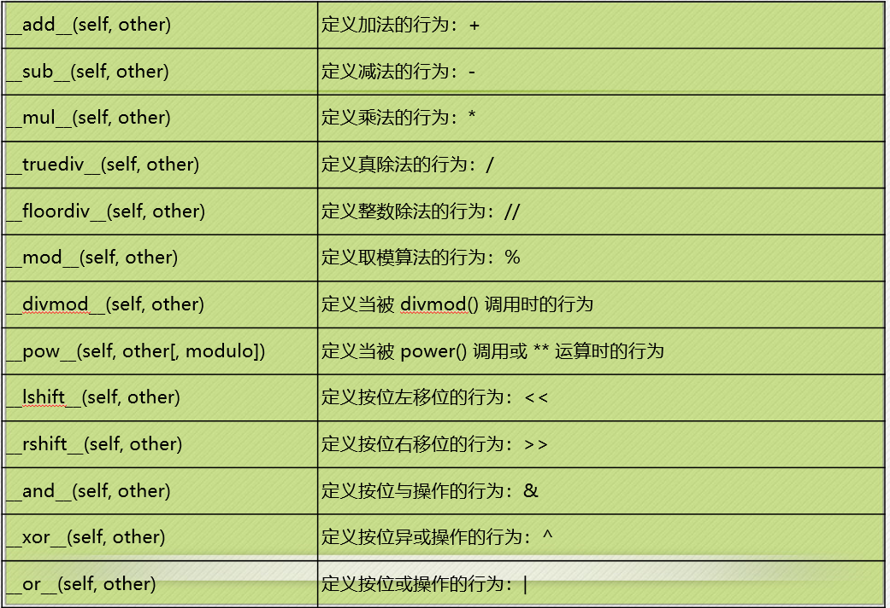

## 魔法方法
- 魔法方法总是被双下横线包围，例如`__init__()`
- 魔法方法是**面向对象的python**的一切
- 魔法方法的魔力体现在它们总能在适当的时候被自动调用
- Python魔法方法详解（http://bbs.fishc.com/thread-48793-1-1.html）
### 构造和析构
#### 构造函数：`__init__(self[,...])`
- 构造函数默认不带参数
- 只有需要的时候才重写构造函数，一般情况不用写


```python
>>> class Rectangle:
...     def __init__(self,x,y):
...             self.x=x
...             self.y=y
...
>>> class Rectangle:
...     def __init__(self,x,y):
...             self.x=x
...             self.y=y
...     def getperi(self):
...             return (self.x+self.y)*2
...
>>> rect = Rectangle()//需加入参数
Traceback (most recent call last):
  File "<stdin>", line 1, in <module>
TypeError: __init__() missing 2 required positional arguments: 'x' and 'y'
>>> rect = Rectangle(3,4)
>>> rect.getperi()
14
```
- 在实例化对象时第一个被调用的是`__new__(cls[,...])`，它的第一个参数是类名，它后边的参数会原封不动的传递给构造方法。
- 需要一个实例对象作为返回值，可以返回任意类的实例对象。
- 极少重写`__new__`方法，但是当继承一个不可变类时，又需要修改时就需要重写该方法。

```python
>>> class Capstr(str): //str是一个不可更改的类
...     def __new__(cls,string):
...             string = string.upper()
...             return str.__new__(cls,string) //调用基类的new方法
...
>>> a = Capstr("I love Fishc")
>>> a
'I LOVE FISHC'
```

#### 析构函数：```__del__(self)```
- 当对象需要被销毁时，就会执行析构方法。
- 并不是发生`del`操作时就会调用析构方法。
- 当它的对象生成之后，所有对它的引用都被`del`之后才会启动垃圾回收机制，垃圾回收机制去销毁这个对象的时候就会调用该析构方法。

```python
>>> class C:
...     def __init__(self):
...             print("我是__init__方法")
...     def __del__(self):
...             print("我是__del__方法")
...
>>> c1=C()
我是__init__方法
>>> c2 = c1 //c2只是增加了一个标签,c3同
>>> c3 = c2
>>> del c3 //不会调用析构函数
>>> del c2
>>> del c1
我是__del__方法
```
### 算术运算

- 

```python
>>> a=int('123')//实例化int对象a
>>> a
123
>>> b=int('456')//实例化int对象b
>>> b
456
>>> a+b    //对象可以相加
579
123
```
- 可以自定义上述魔法方法，实现需要的功能。
- 例如：

法1：
```python
>>> class New_int(int):
...     def __add__(self,other):
...             return int.__add__(self,other)  //调用int的add方法
...     def __sub__(self,other):
...             return int.__sub__(self,other)
...
>>> a=New_int(3)
>>> b=New_int(5)
>>> a+b  //对象相加
8
```
法2：
```python
>>> class Try_int(int):
...     def __add__(self,other):
...             return int(self)+int(other)
...     def __sub__(self,other):
...             return int(self)-int(other)
...
>>> a=Try_int(3)
>>> b=Try_int(5)
>>> a+b
8
```
### 属性访问
- `__getattr__(self,name)`：定义当用户试图获取一个不存在的属性时的行为
- `__getattribute__(self,name)`：定义当该类的属性被访问时的行为
- `__setattr__(self,name,value)`：定义当一个属性被设置时的行为
- `__delattr__(self,name)`：定义当一个属性被删除时的行为
- 示例：
```python
class Rectangle:
    def __init__(self,width=0,height=0):
        self.width = width
        self.height = height  //会自动调用__setattr__(self,name,value)函数

    def __setattr__(self,name,value):
        if name == 'square':
            self.width = value
            self.height = value
        else:
            # self.name = value
            super().__setattr__(name,value)   //调用父类的setattr方法

    def getArea(self):
        return self.width * self.height
```
运行：
```python
>>> r1 = Rectangle(4,5)
>>> r1.getArea()
20
>>> r1.square = 10  //为属性square赋值，说明它是正方形
>>> r1.height
10
>>> r1.width
10
>>> r1.getArea()
```


### 描述符（Property的原理）

描述符：就是将某种**特殊类型的类**的实例指派给另一个类的属性。
这个特殊类型的类必须实现下列条件之一：
- ```__get__(self,instance,owner)```：用于访问属性，用于返回属性的值
- ```__set__(self,instance,value)```：将在属性分配操作中调用，不返回任何内容
- ```__delete__(self，instance)```：控制删除操作，不返回任何内容
- `self`：特殊类的实例对象
- `instance`：拥有者的实例对象
- `owner`：拥有者（另一个类）
- 自定义一个`property`类：


```python
>>> class MyProperty:                              #作为特殊类
	def __init__(self,fget=None,fset = None,fdel=None):
		self.fget=fget
		self.fset=fset
		self.fdel=fdel
	def __get__(self,instance,owner):
		return self.fget(instance)
	def __set__(self,instance,value):
		return self.fset(instance,value)
	def __delete__(self,instance):
		return self.fdel(instance)

>>> class C:
	def __init__(self):
		self._x = None
	def getX(self):
		return self._x
	def setX(self,value):
		self._x = value
	def delX(self):
		del self._x

  x=MyProperty(getX,setX,delX)	//把特殊类（MyProperty）的实例指派给另一个类（C）的属性

>>> c = C()
>>> c.x = 'x-man'
>>> c.x   //通过属性x来帮助改变_x的值
'x-man'
>>> c._x
'x-man'
>>> del c.x
>>> c.x
Traceback (most recent call last):
  File "<pyshell#29>", line 1, in <module>
    c.x
  File "<pyshell#12>", line 7, in __get__
    return self.fget(instance)
  File "<pyshell#23>", line 5, in getX
    return self._x
AttributeError: 'C' object has no attribute '_x'
```

- 示例：定义一个温度类，然后定义两个描述符类用来描述摄氏度和华氏度两个属性。
- 要求**两个属性会自动进行转换**，也就是说你可以给摄氏度这个属性赋值，然后打印的华氏度属性是自动转换后的结果。

```python
class Celsius:
    def __init__(self,value = 26.0):
        self.value = float(value)

    def __get__(self,instance,owner):
        return self.value

    def __set__(self,instance,value):
        self.value = float(value)

class Fahrenheit:

    def __get__(self,instance,owner):
        return instance.cel*1.8+32

    def __set__(self,instance,value):
        instance.cel = (float(value)-32)/1.8

class Temperature:
    cel = Celsius()
    fah = Fahrenheit()
```
运行：
```python
>>> temp = Temperature()
>>> temp.cel
26.0
>>> temp.fah
78.80000000000001
>>> temp.cel = 30
>>> temp.fah
86.0
>>> temp.fah = 100
>>> temp.cel
37.77777777777778
```
### 定制容器（元组、序列、字典）
#### 容器类型的协议
- 如果希望定制的容器是不可变的，需要定义```__len__()```和```__getitem__()```方法。
- 如果希望定制的容器是可变的，除了定义上述两个魔法方法，还需要定义```__setitem__()```和```__delitem__```两个方法。
- 示例：编写一个不可改变的自定义列表，要求记录列表中每个元素被访问的次数。

```python
class CountList:
    def __init__(self,*args):
        self.values = [x for x in args]  #把初始化的值都放入列表中
        self.count = {}.fromkeys(range(len(self.values)),0) #用字典来存取列表下标对应值的访问次数，初始化为0
    def __len__(self):
        return len(self.values)
    def __getitem__(self,key):
        self.count[key] += 1
        return self.values[key]
```
运行：

```python
>>> c1 = CountList(1,3,5,7,9)
>>> c2 = CountList(2,4,6,8,10)
>>> c1[1]
3
>>> c2[1]
4
>>> c1[1]+c2[1]
7
>>> c1.count
{0: 0, 1: 2, 2: 0, 3: 0, 4: 0}
>>> c2.count
{0: 0, 1: 2, 2: 0, 3: 0, 4: 0}
```
### 迭代器
#### 迭代器：提供迭代方法的容器称为迭代器。
- `iter()`：需要自定义```__iter__()```方法
- `next()`：需要自定义```__next__()```方法

#### 生成器：是迭代器的实现，也是迭代器。
- 函数里出现`yield`语句，代表该函数被定义为生成器

```python
>>> def myGen():
	print("生成器被执行！")
	yield 1   #相当于return，会使程序暂停在这个位置
	yield 2
```
运行：
```python
>>> myG = myGen()
>>> next(myG)
生成器被执行！
1
>>> next(myG)
2
>>> next(myG)
Traceback (most recent call last):
  File "<pyshell#48>", line 1, in <module>
    next(myG)
StopIteration
>>> for i in myGen():
	print(i)

生成器被执行！
1
2
```
- 打印斐波那契额数列：

```python
>>> def libs():
	a = 0
	b = 1
	while True:
		a,b=b,a+b
		yield a


>>> for each in libs():
	if each >100:
		break
	print(each,end= ' ')


1 1 2 3 5 8 13 21 34 55 89
```

- 列表推导式

```python
>>> a = [i for i in range(100) if not(i%2) and i % 3] #100以内能被3整除不能被2整除的数
>>> a
[2, 4, 8, 10, 14, 16, 20, 22, 26, 28, 32, 34, 38, 40, 44, 46, 50, 52, 56, 58, 62, 64, 68, 70, 74, 76, 80, 82, 86, 88, 92, 94, 98]
```

- 字典推导式

```python
>>> b = {i:i%2 == 0 for i in range(10)} #写出10以内的数是否是偶数
>>> b
{0: True, 1: False, 2: True, 3: False, 4: True, 5: False, 6: True, 7: False, 8: True, 9: False}
```
- 集合推导式

```python
>>> c = {i for i in [1,2,1,3,4,5,6,1,2]}  #集合不会显示重复的数字
>>> c
{1, 2, 3, 4, 5, 6}
```
- **字符串没有推导式**
-
- **生成器推导式** ：用小括号表示的（跟元组一个形式）

```python
>>> e = (i for i in range(10))  #小括号
>>> e
<generator object <genexpr> at 0x0000021E84BC22B0>   #生成器
>>> next(e)
0
>>> next(e)
1
>>> next(e)
2
>>> for each in e:
	print(each)


3
4
5
6
7
8
9
```
- 生成器推导式作为函数的参数，不用加括号

```python
>>> sum(i for i in range(100) if i % 2)
2500
```
- 生成器参考文档：http://bbs.fishc.com/thread-56023-1-1.html
